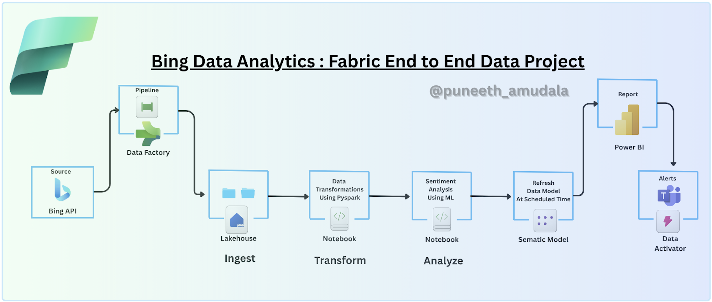

## 🚀 AI-Driven News Intelligence Pipeline with Microsoft Fabric

This project presents a **smart, scalable data engineering solution** using Microsoft Fabric — combining REST API ingestion, Lakehouse architecture, PySpark transformations, machine learning sentiment analysis, and real-time business intelligence through Power BI and Data Activator alerts.

---

### 🔄 End-to-End Workflow

1. **Fabric Workspace & Lakehouse Configuration**

   Initialized a Microsoft Fabric workspace and built a Lakehouse to serve as the central hub for structured and unstructured data.

2. **Dynamic Data Capture from Bing News API**

   Developed automated pipelines using **Copy Activity**  to fetch live news data based on specific keywords.
   Stored the raw JSON payloads directly into Lakehouse bronze tables.

3. **Data Curation with PySpark Notebooks**

   * Parsed and transformed raw data into a normalized schema using PySpark.
   * Applied **Delta Lake architecture** for optimized querying and updates.
   * Introduced **incremental refresh logic** to minimize processing overhead.

4. **Natural Language Processing for Sentiment Detection**

   Applied sentiment scoring to news headlines and descriptions using machine learning.
   Final sentiment-tagged datasets were stored in silver and gold Lakehouse layers.

5. **Power BI Reporting & Visualization**

   * Connected Power BI directly to Lakehouse datasets.
   * Built rich interactive dashboards to track sentiment trends, article volumes, and topic-specific insights.
   * Enabled **slicer-based filtering** by news category and date range.

6. **Pipeline Orchestration & Scheduling**

   * Designed a modular orchestration pipeline to sequence ingestion, transformation, and ML tasks.
   * Introduced **parameterized inputs** for dynamic topic selection.
   * Scheduled automated runs to maintain up-to-date analytics.

7. **Proactive Monitoring with Data Activator**

   * Configured **real-time alerting rules** based on dashboard thresholds (e.g., spikes in negative sentiment for a certain topic).
   * Alerts delivered via integrated notifications.

8. **Validation Across Use Cases**

   Tested the pipeline with multiple keyword scenarios — like *“Technology”*, *“Climate Change”*, *“Sports”* — ensuring reliability and flexibility.

---

### 📂 Featured Components

* 📘 PySpark Notebook – [Structured Cleaning Pipeline](Bing-News/data-transformation-using-pyspark.ipynb)
* 🤖 ML Notebook – [Sentiment Classifier ](Bing-News/news-sentiment-analysis-using-synapse-ML.ipynb)
* 📊 Power BI Report File - [BI-report](Bing-News/Bing-News-Report.pbix)

---

### 🌟 Key Innovations

- ✅ API-powered real-time data ingestion
- ✅ Lakehouse-based bronze-silver-gold architecture
- ✅ Machine learning integration for NLP
- ✅ Power BI dashboard with live data connectors
- ✅ Proactive alerting using Microsoft Data Activator
- ✅ Fully scheduled and modularized pipeline system

---

### 📌 Purpose & Impact

This project bridges **data engineering** with **AI-driven analytics**, offering a production-ready framework for tracking public sentiment trends across news media. It's a blueprint for building intelligent monitoring tools using Microsoft Fabric’s unified platform.

---

### 👨‍💻 Project by

**Puneeth Kumar Amudala**
[LinkedIn](https://www.linkedin.com/in/puneeth-kumar-amudala-4bb7a4245/) | [GitHub](https://github.com/Puneeth0106)

---

